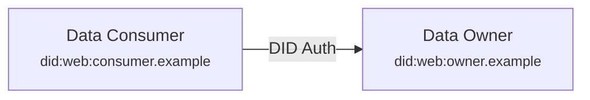
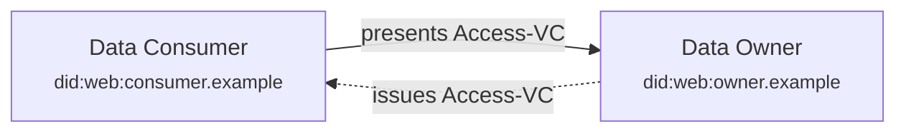
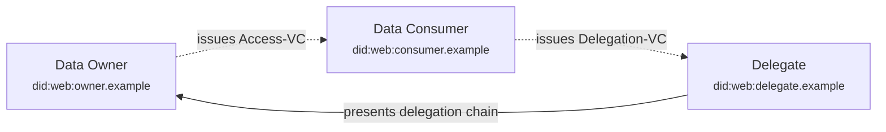
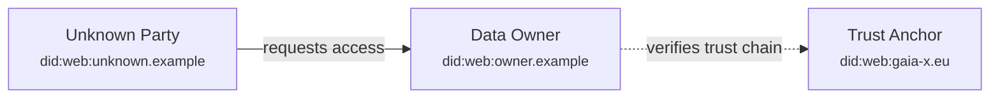
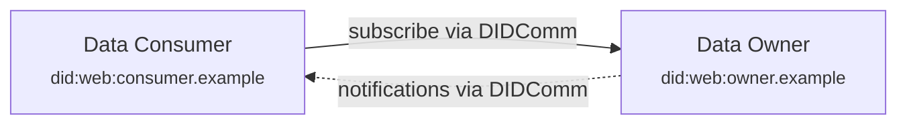
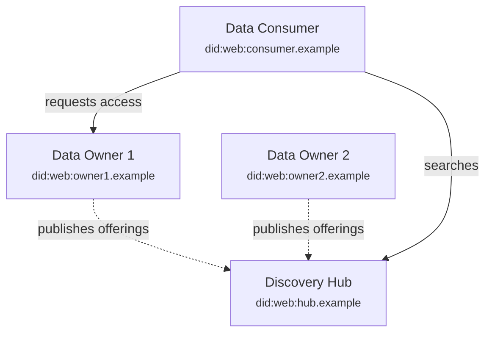

# Examples

This document illustrates how to implement the trust protocol through progressively complex scenarios. Each example builds on the previous, showing what components are needed and—importantly—what stays the same from existing infrastructure.

---

## Example 1: Simple Two-Party Data Sharing

### Scenario

A logistics company (Data Owner) has a shipment tracking API. A retail partner (Data Consumer) needs access. They already know and trust each other through an existing business relationship.

### Starting Point

The logistics company already has a REST API protected by an authorization server (OAuth2 or similar). The retailer currently authenticates with a client ID and secret, receiving a bearer token for API calls.

### What Changes

Only the authentication method changes. Instead of client credentials, the retailer proves ownership of their DID through a challenge-response. The authorization server verifies the signature and checks a whitelist of trusted DIDs. Once verified, it issues a standard access token—the same kind the API already accepts.

The API itself doesn't change at all. It continues to validate bearer tokens exactly as before.

### Components Required

**Data Consumer (Retailer):**

| Component | Purpose |
|-----------|---------|
| DID | Unique identifier (e.g., `did:web:retailer.example`) |
| DID Document | Publicly hosted file containing public key |
| Private Key Storage | Secure storage for signing challenges |
| SIOP Client | Library or service that signs authentication challenges |

**Data Owner (Logistics Company):**

| Component | Purpose |
|-----------|---------|
| DID | Unique identifier for the organization |
| DID Document | Publicly hosted (optional for this scenario, but good practice) |
| Authorization Server | Modified to accept DID challenge-response instead of client credentials |
| DID Whitelist | Simple list of trusted consumer DIDs (database table or config) |
| Existing API | Unchanged—continues accepting bearer tokens |

### What's NOT Needed

- No Verifiable Credentials
- No DIDComm messaging
- No credential wallets
- No trust chain verification
- No contract negotiation
- No changes to the existing API
- No scheme membership or central participant registry (unlike iSHARE, participation is open)
- No compliance certification process (unlike Gaia-X, you start sharing immediately)
- No dedicated connector software (unlike DSP, your existing API infrastructure works)

### Implementation Notes

The DID whitelist replaces the client registry. Where you previously stored client IDs and secrets, you now store DIDs. The authorization server needs a DID resolver (for `did:web`, this is just an HTTPS fetch) and signature verification (standard crypto libraries).

The access token can remain exactly the same format—a JWT with scopes, expiration, and whatever claims the API expects. The only difference is how the client proved their identity to get that token.

For organizations already using OAuth2, this can be implemented as an additional grant type alongside existing methods, allowing gradual migration.

---

## Example 2: Resource-Specific Permissions with Access-VCs

### Scenario

The logistics company wants more granular control. The retailer should only access shipments where they're the recipient. A warehouse partner should be able to update inventory counts but not view pricing. Different partners need different permissions on different resources.

### Starting Point

Building on Example 1, the logistics company has DID-based authentication working. Currently, all authenticated partners get the same access level, controlled by API-level authorization rules.

### What Changes

Instead of (or in addition to) the whitelist, the authorization server now accepts Access-VCs. These credentials specify exactly what resources a partner can access and what actions they can perform. The authorization server verifies the credential and issues a scoped access token reflecting those permissions.

The API still receives bearer tokens, but now those tokens carry fine-grained scopes derived from the Access-VC (e.g., `read:shipments:recipient=self` or `write:inventory:quantity`).

### Components Required

**Data Consumer (adds to Example 1):**

| Component | Purpose |
|-----------|---------|
| Credential Wallet | Stores Access-VCs received from data owners |
| VP Creator | Packages Access-VC into signed Verifiable Presentation |

**Data Owner (adds to Example 1):**

| Component | Purpose |
|-----------|---------|
| VC Issuer | Creates and signs Access-VCs for partners |
| VC Verifier | Validates Access-VCs and extracts permissions |
| Credential Registry | Tracks issued credentials (for revocation) |

### What's NOT Needed

- No DIDComm messaging
- No trust chain verification (partners are still known)
- No delegation support yet
- No changes to API endpoints (only token scopes change)
- No contract negotiation protocol (unlike DSP, access is granted directly through credentials)
- No central authorization registry (each data owner manages their own Access-VCs)

### Implementation Notes

Access-VCs are issued once during partner onboarding—this could be a manual process or a self-service portal. The credential specifies resources, allowed actions, constraints (time limits, purpose), and usage policies.

When authenticating, the consumer includes their Access-VC in the request. The authorization server verifies the VC signature, checks it hasn't been revoked, confirms it matches the requesting DID, and translates the permissions into token scopes.

The API authorization logic may need updates to handle more granular scopes, but this is standard scope-based access control—nothing protocol-specific.

Revocation can be handled through standard VC status lists. The authorization server checks revocation status before issuing tokens.

---

## Example 3: Delegated Access (Delegation Chains)

### Scenario

The retailer needs to delegate access to a customs broker for a specific shipment. The broker should have read access to customs-related documents for 48 hours. The logistics company (data owner) has no direct relationship with the customs broker.

> **Note:** This example uses **delegation chains**—sequences of Access-VCs and Delegation-VCs that transfer access rights from party to party. This is distinct from **trust chains** (covered in Example 4), which establish identity through public credentials.

### Starting Point

Building on Example 2, Access-VCs are working. The retailer holds an Access-VC granting them access to their shipments. Now they need to share a subset of that access with a third party.

### What Changes

The retailer issues a Delegation-VC to the customs broker. This credential references the retailer's original Access-VC and grants a subset of those permissions. When the customs broker requests access, they present the full **delegation chain**: their Delegation-VC containing (or referencing) the retailer's Access-VC.

The logistics company's authorization server now walks the delegation chain: verify the delegation is signed by the retailer, verify the retailer's Access-VC is valid, confirm the delegated permissions don't exceed the original, and issue a token with the delegated scope.

### Components Required

**Delegating Party (Retailer, adds to Example 2):**

| Component | Purpose |
|-----------|---------|
| Delegation VC Issuer | Creates credentials granting subset of own permissions |

**Delegate (Customs Broker):**

| Component | Purpose |
|-----------|---------|
| DID + DID Document | Identity (same as any participant) |
| Private Key Storage | For signing challenges |
| Credential Wallet | Stores received Delegation-VC |
| VP Creator | Packages delegation chain for presentation |

**Data Owner (adds to Example 2):**

| Component | Purpose |
|-----------|---------|
| Delegation Chain Verifier | Walks delegation chain back to original Access-VC |

### What's NOT Needed

- No DIDComm messaging
- No trust chain verification (the delegation chain verifies access rights, not organizational identity—that's a separate mechanism)
- No direct relationship between data owner and delegate
- No changes to API (still token-based access)
- No central delegation registry (unlike iSHARE, delegations are managed peer-to-peer)
- No requirement for the delegate to join any scheme (they just need a DID)

### Implementation Notes

The key insight is that the data owner only needs to verify cryptographic signatures and check that the delegation chain terminates at an Access-VC they originally issued. They don't need to know or trust the customs broker—the retailer has vouched for them within the bounds of the delegation.

Each level of delegation can only reduce permissions, never expand them. The authorization server enforces this by comparing each delegation against its parent.

The delegation chain provides a complete audit trail. The data owner logs who accessed their data and through what authorization path—valuable for compliance.

Delegation-VCs should have short expiration times and can be revoked by the delegating party if needed.

---

## Example 4: Unknown Party with Trust Chain Verification (Trust Chains)

### Scenario

A new carrier requests access to the logistics company's freight matching platform. The logistics company has never worked with this carrier. The carrier has a Gaia-X participant credential and a transport operator license from a national authority.

> **Note:** This example uses **trust chains**—sequences of public credentials in DID Documents that establish identity and trustworthiness by linking to trusted root authorities. This is distinct from **delegation chains** (covered in Example 3), which transfer access rights through Access-VCs.

### Starting Point

The logistics company has the protocol working for known partners (Examples 1-3). Now they receive a request from an unknown DID. The whitelist doesn't help; there's no existing Access-VC to verify.

### What Changes

The authorization server can now evaluate unknown parties by examining public credentials in their DID Document. It resolves the carrier's DID, finds their published credentials, and walks **trust chains** to determine if they're trustworthy.

If the credentials satisfy the policy (e.g., "must have Gaia-X credential" or "must have transport license from EU authority"), the logistics company can grant access—either by adding them to a whitelist for basic access or by issuing an Access-VC for specific permissions.

### Components Required

**Unknown Party (Carrier):**

| Component | Purpose |
|-----------|---------|
| DID + DID Document | Identity, with credentials in service section |
| Public Credentials | Organizational credentials (Gaia-X, licenses, certifications) published in DID Document |
| Private Key Storage | For authentication |

**Data Owner (adds to Example 3):**

| Component | Purpose |
|-----------|---------|
| Trust Chain Walker | Resolves issuer DIDs, verifies public credential chains to trusted roots |
| Trust Anchor Registry | List of trusted root authorities (e.g., "EC", "national transport authority") |
| Policy Engine | Rules for which credentials grant what level of access |

### What's NOT Needed

- No prior relationship with the unknown party
- No central onboarding authority (unlike traditional dataspaces, there's no KYC bottleneck)
- No mandatory scheme membership (Gaia-X or iSHARE credentials help but aren't required)
- No manual approval process (if policy allows automatic access based on credentials)
- No changes to API
- No waiting period—if credentials satisfy your policy, access can be granted immediately

### Implementation Notes

The trust anchor registry is the key policy decision. The logistics company decides which root authorities they trust: European Commission, national regulators, industry associations, Gaia-X, iSHARE scheme authority, etc. This is a business decision, not a technical one.

The policy engine maps credentials to access levels. For example: "Gaia-X participant with transport license → can access freight matching with read permissions." Policies can be as simple or sophisticated as needed.

This is where Gaia-X or iSHARE credentials become valuable—not as gatekeepers, but as trust signals that simplify decisions. An organization with recognized credentials gets streamlined access; others might require additional verification or manual review. The key difference: participation is open to all, and ecosystem credentials accelerate trust rather than being prerequisites for it.

**From trust chain to delegation chain:** After initial trust verification via the trust chain, the data owner typically issues an Access-VC for ongoing access. This Access-VC can then become the starting point for a delegation chain (Example 3) if the new party needs to share access with their own partners.

---

## Example 5: Event-Driven Notifications

### Scenario

The retailer wants to be notified immediately when their shipment status changes, rather than polling the API. They also want alerts when estimated delivery time changes by more than 2 hours.

### Starting Point

The retailer has Access-VC based access working (Example 2). They can query the API for shipment status, but they're polling frequently to catch updates.

### What Changes

Both parties add DIDComm endpoints. The retailer subscribes to events on specific resources, providing their Access-VC to prove they're authorized to receive those notifications. The logistics company acknowledges the subscription and sends encrypted notifications when relevant events occur.

The API remains available for on-demand queries. Notifications supplement rather than replace it.

### Components Required

**Data Consumer (adds to Example 2):**

| Component | Purpose |
|-----------|---------|
| DIDComm Endpoint | Receives encrypted notifications |
| Subscription Manager | Tracks active subscriptions, handles renewals |
| Notification Handler | Processes incoming events, triggers business logic |

**Data Owner (adds to Example 2):**

| Component | Purpose |
|-----------|---------|
| DIDComm Endpoint | Sends notifications, receives subscription requests |
| Subscription Registry | Tracks who subscribed to what, with expiration |
| Event Publisher | Detects changes, matches against subscriptions, sends notifications |

### What's NOT Needed

- No message broker infrastructure (DIDComm is point-to-point)
- No webhook security concerns (messages are encrypted and authenticated)
- No changes to existing API
- No polling from consumer side
- No central event bus or notification service (unlike some dataspace architectures)
- No additional MSA (Mobility Service Agreement) or contract for the notification channel

### Implementation Notes

DIDComm endpoints can be added alongside existing infrastructure. They're HTTP endpoints that handle encrypted messages—standard web server setup with a DIDComm library.

The subscription request includes the Access-VC, proving the consumer is authorized to receive notifications about those resources. The data owner verifies this before accepting the subscription.

Notifications contain event metadata, not necessarily full data. The consumer can fetch details through the regular API if needed. This keeps notifications lightweight and avoids duplicating authorization logic.

Subscriptions should have expiration times and require renewal, preventing stale subscriptions from accumulating.

---

## Example 6: Full Ecosystem with Discovery

### Scenario

Multiple logistics providers, retailers, and service companies want to participate in a shared ecosystem. New participants should be able to discover available data offerings and connect with relevant partners without central coordination.

### Starting Point

Individual bilateral connections work (Examples 1-5). Organizations want to scale beyond manually configured partnerships.

### What Changes

Data owners publish offerings in their DID Documents—descriptions of available data products with access requirements. Discovery hubs crawl these DID Documents and index the offerings, providing search capabilities.

New participants can search hubs to find relevant data sources, examine provider credentials, and initiate access requests—all without prior introductions.

### Components Required

**Data Owner (adds to Example 5):**

| Component | Purpose |
|-----------|---------|
| Offerings in DID Document | Structured descriptions of available data products |

**Data Consumer (adds to Example 5):**

| Component | Purpose |
|-----------|---------|
| Hub Client | Searches discovery hubs, browses results |

**Discovery Hub (new participant type):**

| Component | Purpose |
|-----------|---------|
| DID Crawler | Periodically resolves DID Documents, extracts offerings |
| Search Index | Stores offerings with metadata for querying |
| Search API | Allows queries by category, credential requirements, keywords |
| Hub DID + Credentials | Hub's own identity and trust credentials |

### What's NOT Needed

- No central authority managing the ecosystem
- No mandatory hub registration (organizations can be discovered through multiple hubs or none)
- No single federated catalogue with membership requirements (unlike Gaia-X catalogues)
- No satellite or scheme registry (unlike iSHARE)
- No changes to access control (still Access-VCs and DID auth)
- No data flowing through hubs (they only index metadata—data sharing remains peer-to-peer)

### Implementation Notes

Offerings in DID Documents are structured metadata: title, description, categories, access requirements, endpoints. This is public information—what you offer, not the data itself.

Multiple hubs can coexist. An industry association might run one for their sector. A commercial provider might offer premium discovery features. Organizations register with whichever hubs suit their needs.

Hubs compete on coverage, search quality, and features. They don't control access—they just help parties find each other. Actual data sharing still goes directly between parties using the patterns from earlier examples.

Hub trust matters. Hubs publish their own credentials (who operates them, what standards they follow). Users choose which hubs to query based on these credentials and reputation.

---

## Summary: Incremental Adoption Path

| Phase | What You Add | What You Can Do |
|-------|--------------|-----------------|
| 1 | DID + Auth Server modification | Replace client credentials with DID auth |
| 2 | VC Issuer + Verifier | Fine-grained, credential-based access control |
| 3 | Delegation Chain Verifier | Accept delegated access from partners' partners (via Access-VCs) |
| 4 | Trust Chain Walker + Policy Engine | Onboard unknown parties based on their public credentials |
| 5 | DIDComm Endpoint | Real-time notifications, event-driven workflows |
| 6 | Published Offerings + Hub integration | Ecosystem discovery, scaled partnerships |

**Two types of chains:** Phase 3 adds **delegation chains** (Access-VCs transferring access rights). Phase 4 adds **trust chains** (public credentials establishing identity). Both use credential verification, but serve different purposes.

Each phase builds on the previous. Organizations can stop at any level that meets their needs. A company doing bilateral data sharing with known partners might never need phases 4-6. A platform wanting ecosystem participation implements all six.

The key insight: **existing APIs don't change**. The protocol layers authentication, authorization, and discovery around existing data services. The investment is in identity infrastructure, not rebuilding what already works.

**Open by design:** Unlike frameworks that require scheme membership or compliance certification before you can participate, any organization can start at Phase 1 with nothing more than a DID. Ecosystem credentials from Gaia-X, iSHARE, or industry bodies add value when you have them—they make trust establishment faster—but they're never a barrier to entry. Each participant decides what credentials they recognize; each data owner retains full autonomy over their trust decisions.